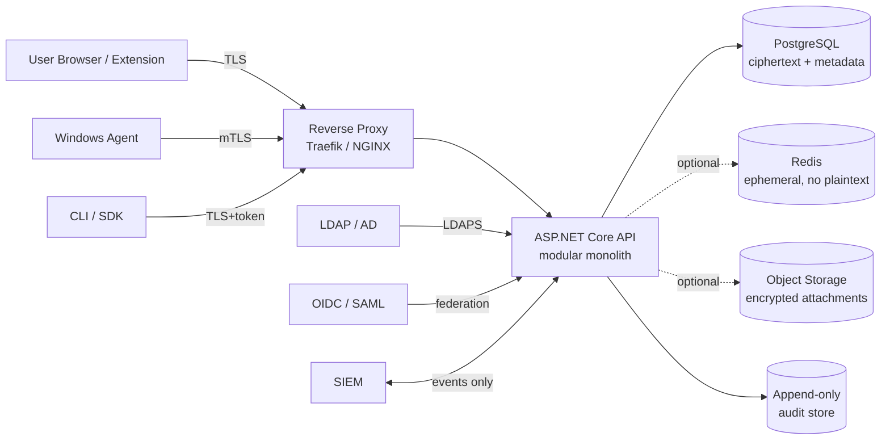

# ARCHITECTURE — pwdmgr / Privora

Status: living document — high-level view only. Authoritative depth lives in [`docs/architecture/product-plan.md`](docs/architecture/product-plan.md).

Last update: 2026-05-16

## High-level topology

Trust boundary: everything on the server side processes **ciphertext + metadata only**. Decryption happens in the browser, browser extension or Windows agent.

## MVP module boundaries (in-process)

See [docs/architecture/module-map.md](docs/architecture/module-map.md) for the canonical list.

- `Identity` — local users, external identities, sessions, MFA.
- `Tenants` — tenant lifecycle, settings, licensing hooks.
- `Vault` — vault, collection, folder, secret metadata; ciphertext payload routing.
- `CryptoMetadata` — public keys, wrapped keys, crypto versions, recovery metadata.
- `Sharing` — ACLs, group access, ownership transfer, temporary access.
- `Policy` — MFA, export, clipboard, agent, template, retention.
- `Audit` — append-only events, hash chaining, SIEM export.
- `AgentGateway` — agent registration, device trust, mediated secret requests.
- `Files` — encrypted file manifests, chunk metadata, object-storage routing.
- `Templates` — typed forms for credentials, certificates, credit cards, licenses, custom.
- `Reporting` — access reports, compliance exports, dashboards.

[ADR-0001](docs/adr/0001-modular-monolith-for-mvp.md) records why we start as a modular monolith and which modules are extraction candidates (audit exporter, agent gateway, LDAP sync worker, rotation worker, reporting, PAM session broker).

## Components / repo layout

| Path | Purpose | Container |
|---|---|---|
| `src/backend/Pwdmgr.Api` | HTTP + module composition | `dbergt/pwdmgr-api` |
| `src/backend/Pwdmgr.Application` | Application services, use cases | (in API image) |
| `src/backend/Pwdmgr.Domain` | Domain entities, invariants | (in API image) |
| `src/backend/Pwdmgr.Infrastructure` | Persistence, LDAP, crypto adapters | (in API image) |
| `src/frontend/` | React + TS + WebCrypto web client | `dbergt/pwdmgr-web` |
| `src/extension/` | Browser extension (MV3) | shipped via stores |
| `src/agent/` | .NET Windows agent + CLI + PowerShell | shipped via signed installer |
| `infra/compose/` | Docker Compose for MVP / lab | — |
| `infra/k8s/` | Future Helm / Kubernetes | — |
| (planned) worker | Background jobs (LDAP sync, rotation) | `dbergt/pwdmgr-worker` |
| (planned) agent-gateway | mTLS agent endpoint, may extract from API | `dbergt/pwdmgr-agent-gateway` |

DockerHub naming convention: [ADR-0004](docs/adr/0004-dockerhub-naming-and-sync-strategy.md).

## Tech baseline

- Backend: .NET 9, ASP.NET Core, EF Core.
- Frontend: React + TypeScript + Vite, WebCrypto API, Argon2id via WASM.
- Database: PostgreSQL 16, row-level security explored.
- Crypto: Argon2id (login + KDF), AES-256-GCM (WebCrypto-native MVP), XChaCha20-Poly1305 (libsodium WASM fallback for nonce robustness), X25519, Ed25519, HKDF-SHA256.
- Deploy: Docker Compose (MVP), Helm/Kubernetes (Enterprise roadmap).
- Reverse proxy: Traefik v3 in compose.

## Cross-cutting concerns

- Multi-tenancy: every row carries `tenant_id`; row-level security planned as defense-in-depth.
- Observability: structured JSON logs, `/healthz` + `/readyz`, Prometheus metrics, trace IDs propagated.
- I18N: German + English from day one for UI and emails.
- Secret hygiene: no plaintext in logs, telemetry, browser local storage, or backups.

## Open architectural questions

Live in [`docs/architecture/product-plan.md`](docs/architecture/product-plan.md) §§37 and 43, and in `STATE.md` (open threads).
