# Enterprise Zero-Knowledge Password-, Secret-, Credential- und PAM-Plattform

Version: 0.1 Architekturplanung  
Datum: 2026-05-01  
Ziel: kommerzielles, mandantenfähiges, containerbasiertes Enterprise-Produkt für On-Premises, Private Cloud, Public Cloud und MSP-Betrieb

Technischer Projektname: `pwdmgr`  
Produktname: noch offen, Arbeitstitel siehe Abschnitt 44

## 1. Executive Summary

Geplant wird eine moderne Enterprise-Plattform für Password Management, Secrets Management, Credential Handling und spätere PAM-Funktionen. Das Produkt kombiniert persönliche Tresore, gemeinsame Tresore, Gruppenfreigaben, LDAP/AD/OIDC/SAML-Identitäten, MFA, Windows-Agent, Browser-Extension, APIs, Audit, Compliance und Roadmap-fähiges PAM.

Die zentrale Sicherheitsentscheidung ist strikt: Authentifizierung und Vault-Entschlüsselung sind getrennt. Login-Passwörter werden nur irreversibel gehasht. Vault-Secrets bleiben entschlüsselbar, aber ausschließlich clientseitig. Server, Datenbankadministratoren, Global Admins, Tenant Admins und Support dürfen keine technische Hintertür zum Lesen von Secrets erhalten.

Empfehlung für den MVP: modularer Monolith mit ASP.NET Core/.NET, React/TypeScript, PostgreSQL, Docker Compose, clientseitiger Kryptografie, Mandantenfähigkeit ab Tag 1, LDAP/AD, lokale Konten, MFA, persönliche Master-Passphrase, persönliche und gemeinsame Vaults, Basis-Browser-Extension, Basis-Windows-Agent, PowerShell/CLI, Audit, Backup/Restore und vorbereiteter Recovery-Struktur.

Spätere Enterprise-Phasen erweitern gezielt um Kubernetes/Helm, SIEM/SOAR, Rotation, Approval/JIT, Session Brokering, RDP/SSH/Web Proxy, Session Recording, Mobile Apps, MSP-Billing und erweiterte Compliance-Reports.

Aktuelle Referenzleitplanken:

- OWASP ASVS 5.0.0 als Zielniveau für Web-Sicherheit: [OWASP ASVS](https://owasp.org/www-project-application-security-verification-standard/)
- OWASP Password Storage Cheat Sheet für Argon2id, Salt, Pepper und Work-Factor-Steuerung: [OWASP Password Storage](https://cheatsheetseries.owasp.org/cheatsheets/Password_Storage_Cheat_Sheet.html)
- OWASP Secrets Management Cheat Sheet für Secret-Lifecycle und Operations: [OWASP Secrets Management](https://cheatsheetseries.owasp.org/cheatsheets/Secrets_Management_Cheat_Sheet.html)
- OWASP Docker Security Cheat Sheet für Container-Hardening: [OWASP Docker Security](https://cheatsheetseries.owasp.org/cheatsheets/Docker_Security_Cheat_Sheet.html)
- NIST SP 800-63-4 als aktuelle Identity-Guideline: [NIST SP 800-63-4](https://pages.nist.gov/800-63-4/)
- NIST CSF 2.0 für Governance, Risk und Cyber-Resilience: [NIST CSF 2.0](https://www.nist.gov/cyberframework)
- OWASP GenAI/LLM Top 10 für Prompt-Injection- und Agentic-AI-Risiken: [OWASP GenAI Security Project](https://owasp.org/www-project-top-10-for-large-language-model-applications)

## 2. Zielbild und Nutzen

Das Produkt soll Unternehmen, MSPs und interne IT-Organisationen befähigen, privilegierte und nicht-privilegierte Secrets kontrolliert zu speichern, zu teilen, zu verwenden, zu auditieren und langfristig zu rotieren.

Primärer Nutzen:

- Zentrale Verwaltung von Passwörtern, SSH-Keys, API-Keys, Zertifikaten, Datenbankzugängen, Service Accounts, RDP-Credentials, TOTP-Seeds, Dateien und Secure Notes.
- Zero-Knowledge-Sicherheitsmodell: Server speichert nur Ciphertext und Metadaten.
- Enterprise Identity: LDAP/AD, OIDC, SAML, lokale Konten, MFA, Rollen, Gruppen, Mandanten.
- Granulare Freigaben: Organisation, Mandant, Vault, Collection, Ordner, Secret, Feld.
- Use-only und Agent-basierter Zugriff ohne unnötige Klartextanzeige.
- Vollständige Auditierbarkeit ohne Offenlegung von Secret-Inhalten.
- Containerisierte, aktualisierbare und hochverfügbare Betriebsform.
- Roadmap zu vollwertigem PAM mit Session Brokering, Proxying, Recording, JIT und Rotation.

## 3. Scope und Nicht-Scope

MVP-Scope:

- Mandantenfähiges Webprodukt mit Docker Compose.
- Lokale Konten, LDAP/AD-Login und vorbereitete OIDC/SAML-Provider-Schnittstellen.
- TOTP und WebAuthn/FIDO2, sofern technisch realistisch im ersten Release.
- Persönliche Master-Passphrase und Zero-Knowledge-Vault.
- Persönliche und Shared Vaults.
- Gruppenfreigabe und Rollenmodell.
- Secret CRUD, Passwortgenerator, Policies Basis.
- Basis-Browser-Extension für Login-Erkennung, Autofill, Speichern, Generator.
- Basis-Windows-Agent mit lokalem Secret-Abruf, CLI/PowerShell und erster Use-only-Übergabe.
- Audit Basis, Admin UI, Tenant Admin UI, Backup/Restore, Monitoring Basis.
- Lizenzierungsfähigkeit im Datenmodell vorbereitet.

Nicht-Scope MVP:

- Vollständiges RDP/SSH/Web Session Brokering.
- Session Recording und Keystroke Logging.
- Mobile Apps.
- Vollständige Rotation für alle Zielsysteme.
- Vollständiger SIEM/SOAR-Katalog.
- Kubernetes/Helm als produktionsreifes Paket.
- MSP-Billing und komplexe Lizenzabrechnung.

## 4. Annahmen und offene Fragen

Annahmen:

- Zielgröße initial 500 bis 5.000 Benutzer, perspektivisch skalierbar darüber hinaus.
- Primäre Kunden betreiben On-Premises oder Private Cloud, MSPs benötigen mehrere Mandanten.
- Zero Knowledge ist nicht verhandelbar, auch nicht gegenüber globalen Administratoren.
- Recovery ist nötig, aber nur kryptografisch kontrolliert mit mehreren Recovery-Officern.
- Windows-Agent ist strategisch wichtig, vollständige PAM-Proxies sind Roadmap.
- Git- und Docker-Hub-Synchronisierung wird als DevSecOps-Prozess geplant, aber konkrete Remote-Namen, Organisationen, Registry-Policies und Credentials müssen noch festgelegt werden.

Offene Grundsatzfragen werden in Abschnitt 37 gruppiert.

## 5. Personas und Use Cases

Personas:

- End User: speichert persönliche Logins, nutzt Autofill und gemeinsame Credentials.
- Secret Owner: verantwortet Secrets, Freigaben, Ablaufdaten und Rotation.
- Vault Admin: verwaltet Tresore, Gruppen, Rollen und Ownership.
- Tenant Admin: verwaltet Mandant, Benutzer, LDAP, MFA, Policies und Agenten.
- Security Admin: setzt Sicherheitsrichtlinien, MFA Enforcement, Exportregeln und Recovery-Policies.
- Auditor: liest Audit, Reports und Compliance-Auswertungen, aber niemals Secret-Klartexte.
- Recovery Officer: nimmt kontrolliert an Recovery-Prozessen teil.
- Approver: genehmigt JIT-/Use-only-/kritische Zugriffe.
- Platform Owner: betreibt Plattform, Updates, Lizenzen und globale Policies.
- MSP Operator: betreibt mehrere Mandanten, Support nur mit expliziter Mandantenfreigabe.
- Developer/DevOps: nutzt CLI, SDK, API und Agent zur sicheren Secret-Nutzung.

Kern-Use-Cases:

- Benutzer meldet sich per LDAP/OIDC/lokal an, bestätigt MFA und entsperrt Vault mit Master-Passphrase.
- Benutzer erstellt Secret, verschlüsselt es lokal und teilt es mit Gruppe.
- Admin bindet LDAP an, mappt Gruppen auf Rollen und Shared Vaults.
- Agent ruft Secret Use-only ab und übergibt es an autorisierten Prozess.
- Browser-Extension füllt Login nach Benutzerinteraktion aus.
- Auditor prüft Zugriffshistorie ohne Secret-Inhalte zu sehen.
- Recovery Officers übernehmen Private Vault eines ausgeschiedenen Mitarbeiters, sofern Enterprise Recovery aktiviert war.
- Rotation Service rotiert Service Account nach Approval und Test-before-commit.

## 6. Funktionale Anforderungen

Muss:

- Mandantenfähigkeit ab MVP.
- Zero-Knowledge-Vault mit clientseitiger Verschlüsselung.
- Lokale Benutzer und lokale Service-/Break-Glass-Konten.
- LDAP/AD mit LDAPS, StartTLS, Zertifikatsprüfung, Signing und Gruppenmapping.
- MFA für Login und Step-up.
- Persönliche Master-Passphrase getrennt von Login.
- Persönliche Vaults, Shared Vaults, Collections, Ordner, Tags, Owner, Kritikalität.
- Secret-Typen: Benutzername/Passwort, RDP, SSH, API-Key, Zertifikat, DB-Credential, Secure Note, Datei, TOTP Seed, Recovery Code, Custom Template.
- Verschlüsselte Dateiablage für wichtige Dokumente, Zertifikatsdateien, Lizenzdateien, Recovery-Unterlagen und sonstige sensible Attachments.
- Thematische Eingabemasken/Templates für z. B. Kreditkarten, Zertifikate, SSH-Keys, API-Zugänge, Datenbanken, Service Accounts, Versicherungen, Lizenzverträge und kundenspezifische Secret-Typen.
- Granulare Rechte: Owner, Admin, Manager, Editor, Contributor, Viewer, Use-only, Request-only, Approver, Auditor, Emergency Access, Kein Zugriff.
- Audit für Login, MFA, Secret-Zugriff, Rechte, Admin, Recovery, Agent, API.
- Import CSV/KeePass/Bitwarden/1Password vorbereiten, Export stark eingeschränkt und auditiert.
- Backup/Restore mit verschlüsselten Payloads und PITR-fähigem PostgreSQL.

Soll:

- OIDC/SAML für Enterprise IdPs.
- SCIM für späteres Provisioning.
- Policies für Export, Clipboard, MFA, Session Timeout, Re-Auth Timeout, IP/Device Trust.
- SIEM Export via Syslog, JSON, Webhook, Splunk, Sentinel, Elastic.
- Browser-Extension mit Phishing-Schutz.
- Agent-Gerätebindung, Health, Revocation und zentralen Policies.
- API, CLI, PowerShell-Modul, .NET/Java/Python SDK.

Kann:

- Push-MFA.
- Mobile Apps.
- PAM-Proxies, Session Recording, Command Control.
- Vollständige automatische Rotation.
- Externe sichere Einmalfreigaben.
- MSP-Billing und mandantenfähiges Branding.

## 7. Nicht-funktionale Anforderungen

Sicherheit:

- OWASP ASVS Level 2 als MVP-Mindestziel, Level 3 für kryptografische, administrative und PAM-nahe Komponenten.
- Keine Klartext-Secrets serverseitig, in Logs, Telemetrie, Browser Local Storage oder ungeschützten Caches.
- Security by Design, Threat Modeling je Epic, Kryptografie-Review vor MVP-Freeze.
- Prompt-Injection-Schutz bei allen optionalen KI-Funktionen: LLMs dürfen niemals direkten Secret-Zugriff, Admin-Aktionen oder Tool-Ausführung ohne Policy-Gate erhalten.

Skalierung:

- 500 bis 5.000 Benutzer initial, horizontale Skalierung API/Web/Worker möglich.
- PostgreSQL als zentrale Datenhaltung, read replicas für Reporting möglich.
- Redis optional nur für kurzlebige nicht-sensitive Zustände.

Betrieb:

- Docker Compose für MVP/Lab.
- Kubernetes/Helm später.
- Health Checks, strukturierte Logs, Metriken, Backups, Restore-Tests.
- Updatefähigkeit mit Migrationen, Rollback-Strategie und semantischer Versionierung.

Compliance:

- ISO 27001, DSGVO, revisionsfähige Audits, Rollen- und Berechtigungsauswertungen.
- Datenklassifizierung, Retention, Löschung, Mandantentrennung.

## 8. Sicherheitsarchitektur

Sicherheitsprinzipien:

- Zero Knowledge: Server kann Secret-Payloads und Vault Keys nicht entschlüsseln.
- Least Privilege: Rechte auf Mandant, Vault, Collection, Secret, Feld, Agent und API-Scope.
- Defense in Depth: Kryptografie, MFA, Device Trust, Policies, Audit, Monitoring, Hardening.
- Separation of Duties: Platform Admin, Tenant Admin, Security Admin, Auditor, Recovery Officer getrennt.
- No Silent Admin Access: Admins können ACLs verwalten, aber nicht heimlich bestehende Secrets lesen.
- Explicit Re-Wrapping: Neue Zugriffe entstehen nur durch kryptografisches Key-Wrapping durch berechtigte Clients oder kontrollierte Recovery-Prozesse.
- Tamper Evidence: Audit-Logs append-only mit Hash-Chaining.

Trust Boundaries:

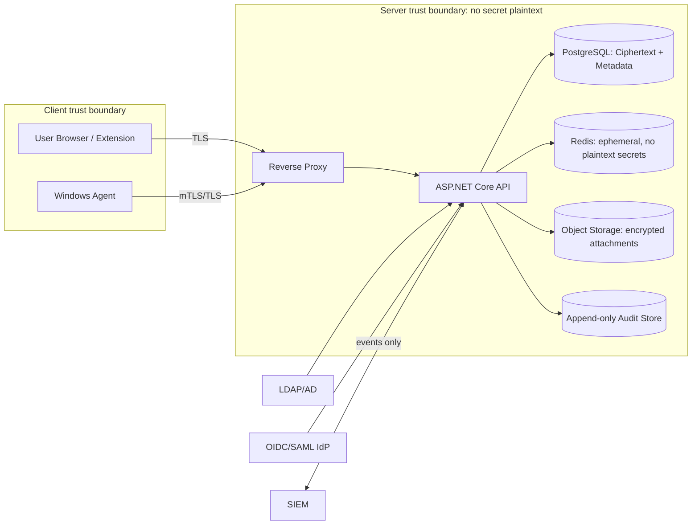

Wichtige Web-Zero-Knowledge-Grenze:

- Ein Webclient wird vom Server ausgeliefert. Ein kompromittierter Server könnte theoretisch bösartiges JavaScript ausliefern und Master-Passphrases exfiltrieren.
- Gegenmaßnahmen: signierte Frontend-Bundles, CSP, Subresource Integrity wo praktikabel, reproduzierbare Builds, Build-Attestations, Extension/Desktop-Agent als vertrauenswürdigerer Krypto-Client, Admin-Policy für "trusted clients only", separate statische Asset-Domain, Content-Security-Policy ohne Inline-Skripte, Integritätsprüfung der Extension, transparente Release-Hashes.

## 9. Kryptografisches Zielmodell

Kryptografische Objekte:

- User Master Passphrase: verlässt den Client nie.
- User KEK: clientseitig aus Master-Passphrase via Argon2id abgeleitet.
- User Private Key: X25519 für Key Agreement, Ed25519 für Signaturen, clientseitig verschlüsselt gespeichert.
- User Public Keys: serverseitig im Klartext als Metadaten erlaubt.
- Vault Key: symmetrischer Schlüssel pro Vault/Collection.
- Secret DEK: eigener Data Encryption Key pro Secret oder pro Secret-Version.
- Group Key: symmetrischer oder asymmetrisch abgesicherter Gruppenschlüssel zur indirekten Freigabe.
- Recovery Public Key: mandantenbezogener Public Key, dessen Private Key via Shamir/M-of-N geschützt ist.

Algorithmen:

- Login-Passwort lokaler Konten: Argon2id mit Salt, optional Pepper in technischem Secret Store/HSM/KMS.
- Master-Passphrase-KDF: Argon2id mit clientseitig gespeicherten Parametern, pro Benutzer Salt, regelmäßig erhöhbarer Work Factor.
- Symmetrische Verschlüsselung: AES-256-GCM als WebCrypto-nativer MVP-Standard; XChaCha20-Poly1305 via libsodium/WASM als Alternative für Nonce-Robustheit.
- Key Agreement: X25519.
- Signaturen: Ed25519 für Freigabe- und Key-Wrapping-Operationen.
- Key Derivation: HKDF-SHA-256 für Subkeys nach erfolgreicher KDF.
- Randomness: CSPRNG des Clients, WebCrypto getRandomValues, Windows CNG im Agent.

Envelope Encryption:

```text
Secret Plaintext
  -> verschlüsselt mit Secret DEK
Secret DEK
  -> verschlüsselt mit Vault Key
Vault Key
  -> verschlüsselt pro User Public Key, Group Key oder Recovery Public Key
Ciphertexts + Nonces + Key-Versionen
  -> gespeichert auf Server
```

Nonce- und Integrität:

- AES-GCM Nonces müssen pro Key eindeutig sein; 96-bit Nonces aus CSPRNG plus Kollisionsschutz.
- XChaCha20-Poly1305 bevorzugt bei sehr vielen Verschlüsselungen pro Key, weil 192-bit Nonces robustere Zufallsnutzung erlauben.
- Associated Data enthält tenant_id, vault_id, secret_id, version, crypto_version, creator_id und policy_hash.
- Jede Secret-Version ist unveränderlich; Updates erzeugen neue Versionen.
- Clients prüfen Crypto-Version, Key-Version, Signaturen und Associated Data.

Key Rotation:

- Secret Rotation: neue Secret-Version und optional neuer DEK.
- Vault Key Rotation: neue Vault-Key-Version, Re-Wrap aller aktiven Secret-DEKs.
- Group Key Rotation: bei Gruppenmitgliedschaftsänderungen oder kompromittiertem Mitglied.
- User Key Rotation: bei Geräte-/Passphrase-/Account-Kompromittierung.
- Recovery Key Rotation: M-of-N-Prozess, Re-Wrap aller Vault Keys, Audit Pflicht.

Grenzen:

- Verlorene Master-Passphrase ohne Recovery bedeutet: Private Vaults sind kryptografisch nicht wiederherstellbar.
- Server kann alte, bereits synchronisierte Ciphertexts nicht aus einem kompromittierten Client löschen. Zugriffsentzug wirkt für zukünftige Abrufe und neue Key-Versionen.

## 10. Authentifizierung und MFA

Authentifizierungswege:

- Lokal: Benutzername/E-Mail plus Passwort-Hash Argon2id, MFA, Mandantenzuordnung.
- LDAP/AD: Bind oder Kerberos-nahe Erweiterung später, LDAPS/StartTLS, Signing, Zertifikatsprüfung.
- OIDC/SAML: pro Mandant konfigurierbar, vorbereitet im MVP, produktionsreif Phase 2.
- Break-Glass: lokale Konten mit Hardware-Key, starker Auditierung, IP-Allowlist und getrennter Recovery-Prozedur.

Unlock-Flow:

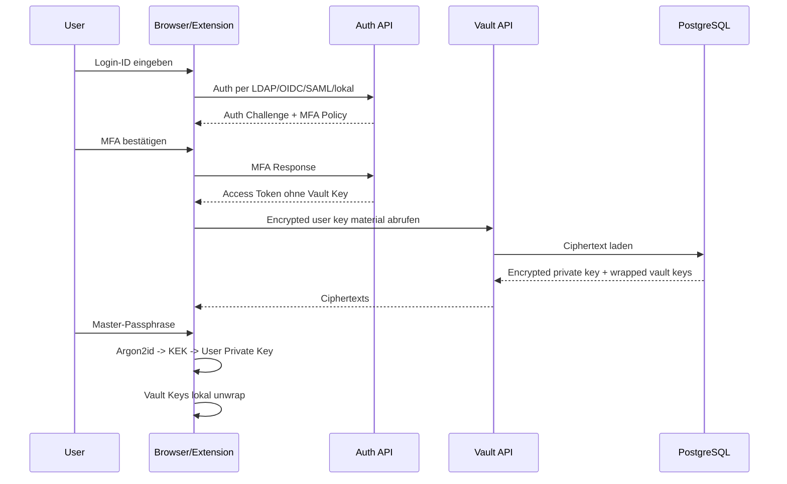

LDAP mit Zero Knowledge:

- LDAP/OIDC/SAML beweist Identität, liefert aber keinen dauerhaften Vault-Schlüssel.
- Das LDAP-Passwort darf nicht als Master-Key dienen, weil es geändert werden kann, in Enterprise-Flows an fremden Systemen validiert wird und nicht unter alleiniger Kontrolle des Vault-Clients steht.
- Nach erfolgreicher Authentifizierung entsperrt der Benutzer lokal mit persönlicher Master-Passphrase.
- Optional: Trusted Device Unlock. Der User Private Key wird zusätzlich lokal mit DPAPI/TPM/Biometrie geschützt, nie serverseitig entschlüsselbar.
- Optional Enterprise SSO Unlock nur mit kundenseitigem External Key Manager oder Hardware-backed Client Key. Das ist ein Enterprise-Modul, nicht MVP-Default.

MFA:

- TOTP als pragmatischer MVP-Baseline-Faktor.
- WebAuthn/FIDO2/Passkeys bevorzugt für Admins, Recovery Officer und Break-Glass.
- Recovery Codes einmalig, gehasht gespeichert.
- Step-up für Secret anzeigen, Export, Rechteänderung, Admin, Agent-Freigabe, Recovery, Notfallzugriff.
- MFA Enforcement pro Mandant, Rolle, Vault, Secret-Kritikalität, Netzwerk und Device Trust.

## 11. LDAP-/AD-Integration

LDAP-Funktionen:

- Mehrere Verzeichnisse pro Mandant.
- LDAPS und StartTLS mit Zertifikatsprüfung.
- LDAP Signing und Channel Binding, soweit Umgebung unterstützt.
- Suchbasis, Filter, Attribute Mapping, UPN/sAMAccountName/mail.
- Gruppen-Sync rekursiv, nested groups optional.
- JIT-Provisioning beim ersten Login.
- Deprovisioning bei disabled/deleted LDAP accounts.
- Dry-run und Sync-Berichte.
- Konfliktlösung für gelöschte, umbenannte und reaktivierte Benutzer.

LDAP Sync:

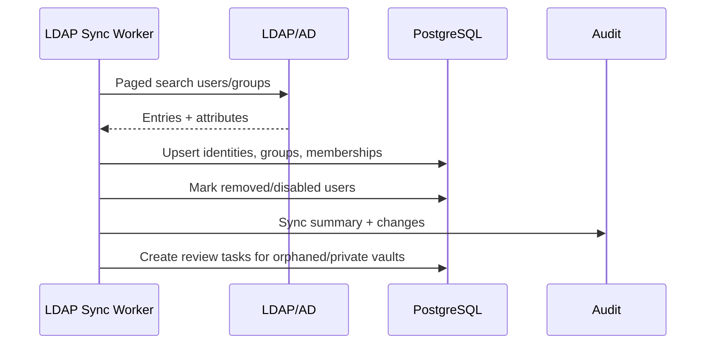

Deaktivierte LDAP-Benutzer:

- Account Status: Disabled.
- Login sofort blockieren.
- Sessions und Refresh Tokens widerrufen.
- Agent Tokens widerrufen oder auf Review setzen.
- Shared Vault Ownership prüfen und neu zuweisen.
- Private Vaults als orphaned but protected markieren.
- Recovery nur, wenn Enterprise Recovery vorher aktiv war.

Gruppenänderungen:

- Hinzufügen: Zugriff erst, wenn Group Key für Mitglied gewrappt wurde.
- Entfernen: zukünftiger Zugriff blockiert, Group Key Rotation für kritische Vaults empfohlen oder erzwungen.
- Kritische Vaults: automatische Re-Wrap/Rotation-Task.
- Alte lokal entschlüsselte Daten auf kompromittierten Clients können technisch nicht rückwirkend "ungesehen" gemacht werden. Das muss über kurze Sessions, Auto-Lock, Agent-Policies und Rotation kompensiert werden.

## 12. Benutzer-, Gruppen- und Rollenmodell

Globale Plattformrollen:

- Platform Owner: Produkt-/Plattformverantwortung.
- Global System Admin: Infrastruktur und globale Konfiguration, kein Secret-Zugriff.
- Global Security Admin: globale Sicherheitsrichtlinien und Incident Controls.
- Global Auditor: mandantenübergreifende Betriebs- und Sicherheitsberichte ohne Secret-Inhalte.
- License Admin: Lizenzverwaltung.
- Support Admin: Support nur nach expliziter, zeitlich begrenzter Mandantenfreigabe.

Mandantenrollen:

- Tenant Owner: oberste fachliche Verantwortung.
- Tenant Admin: Benutzer, Gruppen, LDAP, OIDC/SAML, Vault-Konfiguration.
- Tenant Security Admin: MFA, Policies, Recovery, Incident Controls.
- Tenant Auditor: Audit und Reports.
- Vault Admin: Vault-Struktur, Owner, ACLs.
- Group Manager: interne Gruppenmitgliedschaften.
- Recovery Officer: M-of-N-Recovery.
- Approver: Zugriffsgenehmigungen.
- User: regulärer Benutzer.

Objektrollen:

- Secret Owner: volle Verantwortung, kann Freigaben verwalten.
- Secret Editor: Inhalte ändern.
- Secret Viewer: anzeigen und kopieren, falls Policy erlaubt.
- Secret User: Use-only über Agent/Extension.
- Contributor: neue Secrets hinzufügen, nicht alle lesen.
- Request-only: Zugriff beantragen.
- Auditor: Metadaten/Audit, keine Secret-Inhalte.

Mandantentrennung:

- Jede relevante Entität trägt tenant_id.
- Mandantenübergreifende Standardzugriffe sind unmöglich.
- PostgreSQL Row-Level-Security wird geprüft und bevorzugt für Defense in Depth.
- Supportzugriff ist "consent based", zeitlich begrenzt, auditiert und ohne Secret-Klartext.

## 13. Tresor-/Secret-/Sharing-Modell

Organisationsobjekte:

- Tenant
- Vault
- Collection
- Folder
- Secret
- Secret Field
- Attachment
- Tag
- Asset/System
- Environment
- Owner Group
- Policy Binding

Secret-Erstellung:

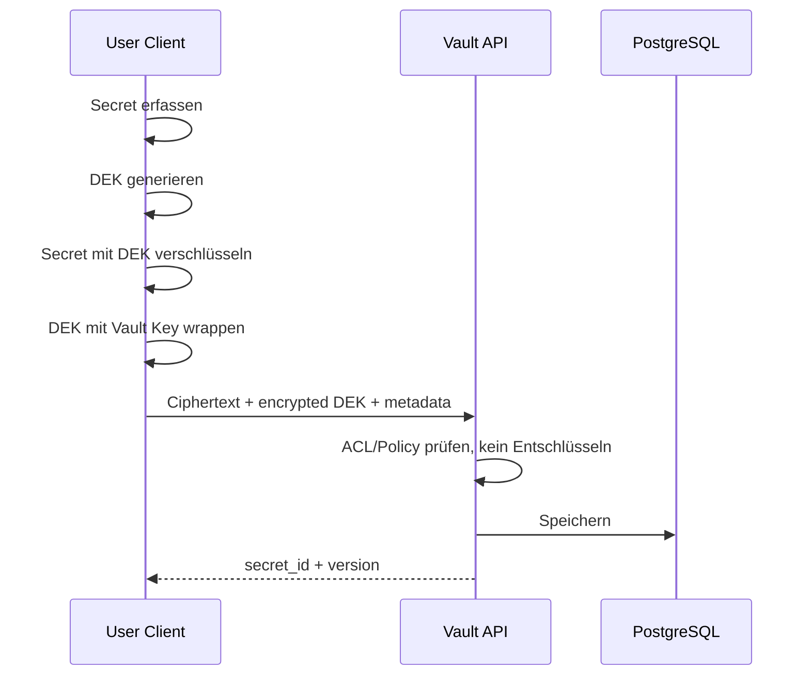

Dateiablage und Attachments:

- Dateien sind First-Class-Secret-Objekte oder Attachments an Secrets.
- Dateiinhalt wird immer clientseitig verschlüsselt, bevor Upload startet.
- Pro Datei oder Dateiversion wird ein eigener File DEK erzeugt.
- Große Dateien werden chunkweise verschlüsselt, damit Upload/Download fortsetzbar bleiben.
- Jeder Chunk erhält eigene Nonce/IV und Auth Tag; Manifest enthält Chunk-Reihenfolge, Hashes, Größen und Crypto-Version.
- Das Manifest selbst wird ebenfalls verschlüsselt oder signiert, abhängig vom Such-/Preview-Modell.
- Object Storage sieht nur verschlüsselte Blobs.
- Server darf Dateiname, MIME-Type und Größe nur speichern, wenn Policy dies erlaubt; sonst werden auch Dateiname und Beschreibung verschlüsselt.
- Antivirus/DLP-Scanning ist bei Zero Knowledge nur clientseitig, agentseitig oder über optionalen kundenseitigen Scan-Client möglich. Serverseitiges Scanning von Klartextdateien ist ausgeschlossen.
- Previews für PDFs/Bilder/Dokumente dürfen nur lokal im Client oder Agent erzeugt werden.
- Versionierung, Ablaufdatum, Legal Hold und Retention sind pro Datei möglich.

Template-/Maskenmodell:

- Jedes Secret basiert auf einem Secret Type und optional einer Template-Version.
- Templates definieren Felder, Validierungen, Maskierung, Rechte, Generatoren, Ablaufdaten und Rotation-Hooks.
- Feldtypen: text, password, passphrase, username, url, email, hostname, port, private_key, public_key, certificate, file, date, number, iban, credit_card_number, cvv, totp_seed, json, multiline_secret, secure_note.
- Feldattribute: required, masked, copyable, view_requires_step_up, use_only, exportable, searchable_metadata, encrypted_label, validation_regex, expiry_warning, rotation_supported.
- Templates sind mandantenfähig und versioniert.
- Alte Secrets behalten ihre Template-Version, können aber kontrolliert migriert werden.
- Custom Templates erlauben kundenspezifische Masken ohne Codeänderung.
- UI rendert dynamische Formulare aus Template-Schema, Backend validiert nur Struktur und Policy, nicht Klartextinhalte.

Beispieltemplates:

- Kreditkarte: Karteninhaber, Kartennummer, Ablaufdatum, CVV, PIN optional, Bank, Notiz, Dokumente, Support-Telefon, Limit/Kritikalität.
- Zertifikat: Common Name, SANs, Issuer, Serial, Ablaufdatum, Public Certificate, Private Key, Chain, PFX/P12-Datei, Passphrase, Zielsysteme, Erneuerungsworkflow.
- SSH Key: Benutzer, Host, Port, Private Key, Public Key, Passphrase, Fingerprint, Allowed Commands, Rotation Date.
- Datenbankzugang: DB-Typ, Host, Port, Datenbank, Benutzer, Passwort, SSL-Zertifikat, Connection String Template.
- Lizenz: Hersteller, Produkt, Lizenzkey, Vertragsdatei, Ablaufdatum, Seats, Ansprechpartner.
- Versicherung/Vertrag: Vertragsnummer, Anbieter, Ansprechpartner, Policen-Datei, Laufzeit, Kündigungsfrist, sensible Notizen.

Sharing mit Gruppe:

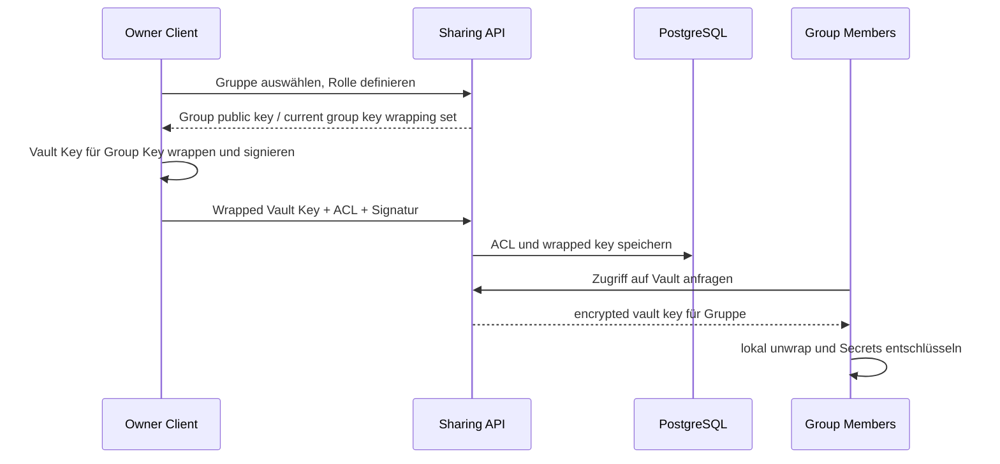

Rechte:

- Organisationsebene: Tenant Admin, Security Admin, Auditor.
- Vault-Ebene: Owner, Admin, Manager, Editor, Viewer, User, Auditor.
- Collection/Folder-Ebene: Vererbung plus explizite Overrides.
- Secret-Ebene: Zugriff differenziert nach view/copy/use/export/manage/share/rotate.
- Feld-Ebene: optional, besonders für TOTP Seed, Passwort, Private Key, Notes.

Sharing ohne Server-Entschlüsselung:

- Berechtigter Client entschlüsselt lokal den Vault Key.
- Client verschlüsselt Vault Key oder Secret Key für Zielbenutzer, Gruppe oder Recovery Public Key.
- Server validiert Berechtigung, Signatur und Policy, speichert nur Wrapped Keys.
- Admins können keine neuen lesbaren Wrapped Keys für sich erzeugen, weil ihnen der Klartext-Vault-Key fehlt.

## 14. Windows-Agent-Konzept

Agent-Komponenten:

- Windows Service: Gerätekonto, lokale Policies, Cache, mTLS, Named Pipe.
- User Tray App: UI, MFA/Approval, Session Lock, Auswahl, Status.
- CLI: skriptfähiger Zugriff.
- PowerShell-Modul: Secret-Abruf für Admins/Automation.
- Optional Credential Provider: spätere Phase.
- Optional RDP Launcher: MVP+ oder Phase 3.

Sicherer Agent Secret Request:

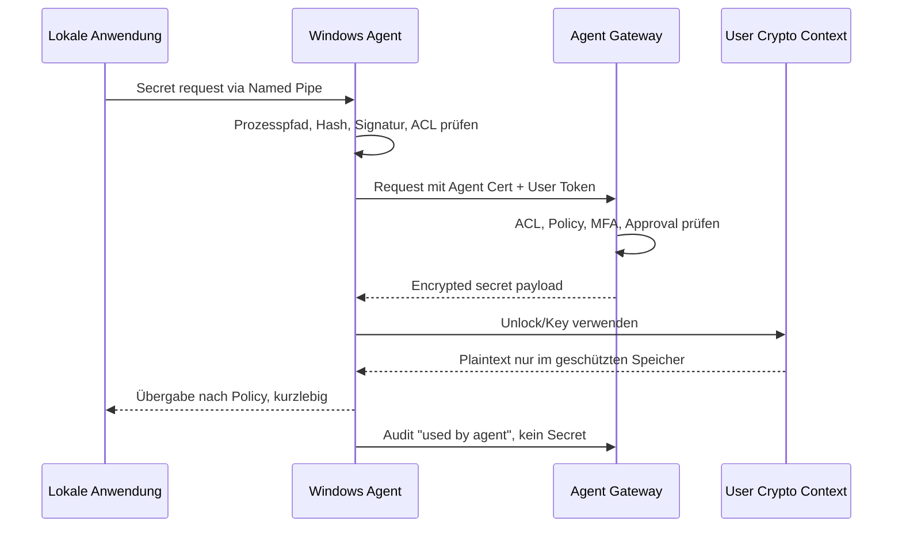

Betriebsarten:

- Anzeigen: Secret wird nach Step-up angezeigt.
- Kopieren: Clipboard mit automatischem Clear, Clipboard-Audit optional.
- Use-only: Agent injiziert/übergibt, Benutzer sieht Secret nicht.
- Application-bound: Prozessname, Pfad, Hash, Code Signing, Publisher, Parent Process, User Context, Device Trust.
- Session-bound: kurzlebige Tokens, Cache-Löschung nach Session.
- Approval-bound: Freigabe durch Approver.
- Ticket-bound: Ticketnummer/Change/Incident Pflicht.

Lokale Schnittstellen:

- Named Pipe mit Windows ACL als bevorzugte MVP-Schnittstelle.
- localhost HTTPS mit mTLS für browser-/plattformnahe Integrationen.
- CLI und PowerShell mit kurzlebigen Tokens.
- SDKs später.

Lokaler Schutz:

- DPAPI Current User oder Local Machine je Modus.
- TPM/Windows Hello for Business optional.
- Windows Credential Manager für nicht-exportierbare Tokens prüfen.
- Kein Klartext-Cache.
- Verschlüsselter Cache nur policygesteuert, Offline-Modus stark eingeschränkt.
- Secure memory best effort, schnelle Zeroization, keine Dumps, Crash Dump Policy.
- Signierte Binaries und Updates, Update-Metadaten signiert.
- Agent-Zertifikat pro Gerät, widerrufbar.

Grenzen der Credential Injection:

- RDP: mstsc kann Credentials begrenzt über Credential Manager/Cmdkey/Launcher-Flows nutzen; vollständige sichere Injection ohne Klartextanzeige ist schwierig und abhängig von Windows-Version, NLA, Policies und Credential Guard.
- Web: Browser-Extension ist sicherer als generisches UI-Automation-Hooking; Autofill muss User Interaction Required und Domain-Prüfung nutzen.
- Java/.NET: SDK/Local API ist sauberer als Prozess-Memory-Hooking. Hooking ist riskant, fragil und sollte nur kontrolliert erfolgen.
- Windows Desktop Apps: UI Automation kann funktionieren, ist aber anfällig für Fokusdiebstahl und Spoofing. Nur application-bound und mit Warnhinweisen.
- Dienste/Tasks: besser Secret zur Laufzeit über Agent/SDK abrufen oder kontrolliert Windows Credential Manager/Service Account Rotation nutzen, nicht dauerhaft in Config schreiben.

## 15. API-/CLI-/SDK-Konzept

API-Prinzipien:

- REST für Web, Admin, Automatisierung.
- gRPC optional für Agent Gateway und performante Streams.
- OAuth2 Client Credentials optional für Maschinenidentitäten.
- API Tokens nur gehasht gespeichert, scopes, expiry, tenant_id, owner, last_used.
- mTLS für Agenten und Service Accounts.
- Rate Limiting und per-scope Quotas.
- Jede API-Nutzung auditieren.
- Keine API liefert Klartext-Secrets an Server-seitige Komponenten; Klartext entsteht nur im autorisierten Client/Agent.

Beispiel-Endpunkte:

```http
POST   /api/v1/auth/login/local
POST   /api/v1/auth/login/ldap
POST   /api/v1/auth/mfa/verify
POST   /api/v1/vault/unlock-metadata
GET    /api/v1/tenants/{tenantId}/vaults
POST   /api/v1/vaults
POST   /api/v1/vaults/{vaultId}/secrets
GET    /api/v1/secrets/{secretId}
POST   /api/v1/secrets/{secretId}/versions
POST   /api/v1/secrets/{secretId}/share
POST   /api/v1/secrets/{secretId}/rotate
GET    /api/v1/secret-templates
POST   /api/v1/secret-templates
POST   /api/v1/files/initiate-upload
PUT    /api/v1/files/{fileId}/chunks/{chunkNo}
POST   /api/v1/files/{fileId}/complete
GET    /api/v1/files/{fileId}/download-metadata
POST   /api/v1/agents/register
POST   /api/v1/agents/{agentId}/revoke
GET    /api/v1/audit/events
POST   /api/v1/recovery/requests
POST   /api/v1/recovery/requests/{id}/approve
```

CLI-Beispiele:

```powershell
zkpam login --tenant contoso --method oidc
zkpam vault unlock
zkpam secret get prod/sql/admin --field password --use-only
zkpam secret create --vault "IT Prod" --type db-credential --from-json secret.json
zkpam audit export --from 2026-05-01 --format jsonl
```

SDKs:

- .NET zuerst wegen Backend/Agent-Stack.
- Python für DevOps/Automation.
- Java für Enterprise Apps.
- SDKs nutzen lokale Agent API bevorzugt, direkte Web API optional.

## 16. Audit-, Reporting- und Compliance-Konzept

Audit Events:

- Login success/failure, MFA enrollment/verify/failure.
- Vault unlock metadata request.
- Secret create/update/delete/view/copy/use/export.
- Agent use, application-bound checks, denied requests.
- Rechte-, Gruppen-, LDAP-, Policy- und Admin-Änderungen.
- Recovery request/approval/execution.
- Break-glass und Emergency Access.
- Rotation, Import, Export.
- API Token create/use/revoke.
- Support Access Grant.

Manipulationsschutz:

- Append-only Audit-Tabelle oder separates Audit-Store.
- Hash-Chaining: event_hash = H(previous_hash + canonical_event_json).
- Regelmäßige Anchors in externem WORM/SIEM/Object Lock.
- Signierte Audit Batches.
- Trennung von operativen Logs und Compliance Audit.

Audit ohne Secret-Offenlegung:

- Event enthält secret_id, vault_id, tenant_id, actor, action, timestamp, client_type, source_ip, device_id, policy_result.
- Keine Secret-Werte, keine Klartext-Feldnamen, keine Payload-Auszüge.
- Sensible Metadaten minimieren oder verschlüsseln.

Reports:

- Wer hat worauf Zugriff?
- Wer hat welches Secret wann genutzt?
- Schwache, alte, unrotierte oder ablaufende Secrets.
- Kritische Service Accounts.
- Exporte und Exportversuche.
- Benutzer ohne MFA.
- LDAP-Gruppen mit Zugriff auf kritische Vaults.
- Orphaned Vaults und Recovery-Status.
- Agenten offline/veraltet/unsicher.
- Policy-Verstöße.

DSGVO:

- Personenbezogene Auditdaten mit Retention.
- Pseudonymisierung nach Löschung, soweit Compliance erlaubt.
- Trennung Benutzerprofil vs. geschäftliche Secret-Ownership.
- Lösch-/Exportprozesse dokumentiert.

## 17. Secret-Rotation und PAM-Erweiterungen

Rotation Targets:

- AD Service Accounts über LDAPS/privilegierten Rotator.
- Lokale Windows Accounts via Agent/WinRM optional.
- Linux Accounts via SSH.
- Datenbanken: PostgreSQL, MS SQL, MySQL, Oracle später.
- API Keys mit provider-spezifischen Connectors.
- Zertifikate via ACME/CA-Integration.
- Kubernetes Secrets via Kubernetes API.
- RDP/Admin-Konten.

Rotation-Flow:

- Plan/Policy bestimmt Ziel, Maintenance Window, Approval, Rollback.
- Test-before-commit: neues Credential setzen, Login testen, abhängige Systeme aktualisieren.
- Commit: Secret-Version aktualisieren, alte Version sperren.
- Rollback: bei Fehler altes Credential wiederherstellen, sofern Zielsystem erlaubt.
- Audit vollständig, keine Klartexte in Logs.

PAM Roadmap:

- Account Discovery und Onboarding.
- Checkout/Checkin und Rotation nach Checkout.
- RDP Session Broker.
- SSH Proxy mit Command Control.
- Web Proxy.
- Session Recording.
- Credential-less Access.
- JIT Privileged Access.
- Ticket-/ITSM-Integration.
- SIEM/SOAR-Integration.

## 18. Container-/Deployment-Architektur

MVP Docker Compose:

- reverse-proxy: Traefik oder NGINX.
- web: React static assets.
- api: ASP.NET Core modular monolith.
- worker: .NET Worker Services.
- postgres: primäre Datenbank.
- redis: optional für kurzlebige Jobs/Sessions, keine Klartext-Secrets.
- object-storage: optional MinIO für verschlüsselte Attachments.
- prometheus/grafana/loki: Lab/optional.

Container-Architektur:

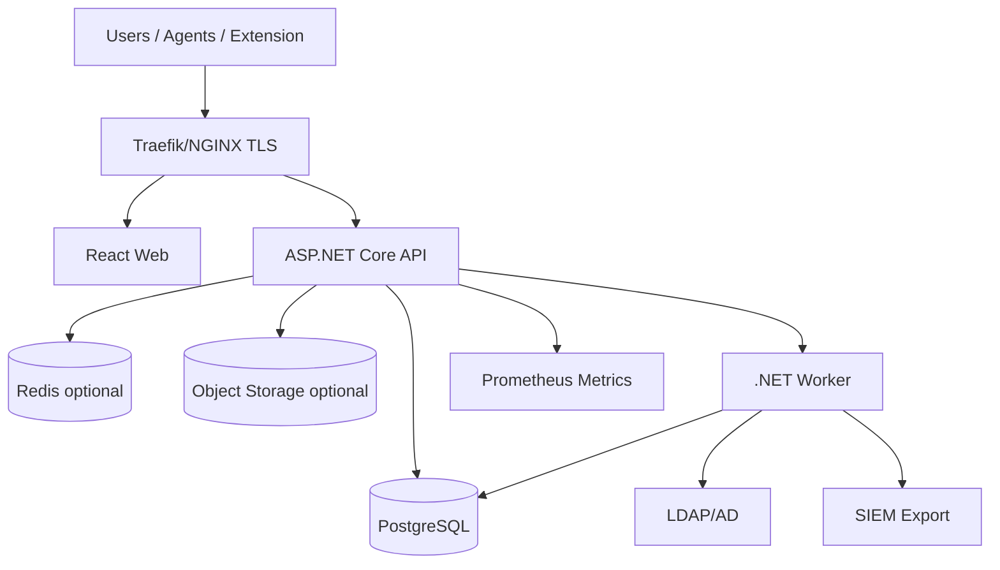

Hardening:

- Non-root User.
- Read-only root filesystem, tmpfs für temporäre Pfade.
- Capabilities drop.
- No Docker socket mount.
- Resource Limits.
- Separate Netzwerke: public, app, data, monitoring.
- Secrets nicht in Environment, wenn vermeidbar; Docker/Kubernetes Secrets, Dateien mit restriktiven Rechten.
- Image Signing, SBOM, Vulnerability Scanning.
- Minimal Base Images, regelmäßige Updates.
- TLS extern, mTLS intern optional in Phase 2/3.

Enterprise Kubernetes:

- Helm Chart.
- Ingress Controller: NGINX, Traefik oder Envoy.
- Network Policies.
- Pod Security Standards restricted.
- External PostgreSQL HA oder Operator.
- External Secrets Operator optional für technische Betriebssecrets.
- HPA für API/Web/Worker.
- PodDisruptionBudgets.
- Backup Jobs.
- GitOps mit Argo CD/Flux optional.

## 19. Datenbank- und Datenmodell

PostgreSQL ist primäre Datenbank. Redis ist optional und speichert keine Klartext-Secrets. Attachments liegen optional in Object Storage, immer clientseitig verschlüsselt.

Grobe Trennung:

- Identity Metadata.
- Tenant Metadata.
- Vault Metadata.
- Encrypted Secret Payloads.
- Key Wrapping Metadata.
- Audit Logs.
- Agent Inventory.
- Policies.
- Reports.
- Licenses.

Grobe Tabellen:

```sql
tenants(id, name, status, plan, created_at)
users(id, tenant_id, external_id, source, email, display_name, status, created_at)
local_credentials(user_id, password_hash, password_params, pepper_version)
mfa_factors(id, tenant_id, user_id, type, public_data, secret_ciphertext, status)
groups(id, tenant_id, source, external_id, name)
group_memberships(group_id, user_id, status)
roles(id, tenant_id, name, scope)
role_assignments(id, tenant_id, subject_type, subject_id, role_id, resource_type, resource_id)
vaults(id, tenant_id, type, name, owner_id, status, crypto_version)
collections(id, tenant_id, vault_id, parent_id, name)
secrets(id, tenant_id, vault_id, collection_id, type, name_ciphertext, metadata_json, status)
secret_versions(id, tenant_id, secret_id, version_no, payload_ciphertext, aad_hash, created_by)
secret_fields(id, tenant_id, secret_version_id, field_key_ciphertext, field_type, mask_policy)
attachments(id, tenant_id, secret_id, object_key, ciphertext_hash, size)
file_objects(id, tenant_id, vault_id, secret_id, current_version_id, status, classification)
file_versions(id, tenant_id, file_object_id, encrypted_manifest, object_prefix, total_size, chunk_count, created_by)
secret_templates(id, tenant_id, name, version, schema_json, policy_json, status)
secret_template_bindings(id, tenant_id, secret_id, template_id, template_version)
wrapped_keys(id, tenant_id, resource_type, resource_id, recipient_type, recipient_id, key_version, ciphertext)
crypto_keys(id, tenant_id, key_type, public_key, status, version)
policies(id, tenant_id, type, document_json, version, status)
audit_events(id, tenant_id, ts, actor_id, action, resource_type, resource_id, event_json, prev_hash, event_hash)
agents(id, tenant_id, device_id, user_id, cert_thumbprint, status, version, last_seen)
api_tokens(id, tenant_id, owner_id, token_hash, scopes, expires_at, last_used_at)
recovery_requests(id, tenant_id, vault_id, subject_user_id, status, policy_snapshot)
licenses(id, tenant_id, edition, limits_json, valid_until)
```

Indexierung:

- Erlaubt: tenant_id, IDs, status, Secret-Typ, Kritikalität, Ablaufdatum, Tags, Owner, Asset-Verknüpfung, nicht-sensitive normalisierte Domain-Hashes.
- Nicht erlaubt: Klartext-Secrets, Klartext-Notizen, Passwörter, Private Keys, TOTP Seeds.
- Suchkonzept: MVP sucht nur freigegebene nicht-sensitive Metadaten. Enterprise kann clientseitigen verschlüsselten Suchindex pro Benutzer/Vault prüfen. Trade-off: Suchkomfort vs. Metadatenleckage.

Mandantentrennung:

- tenant_id auf allen Tabellen.
- Composite Indexes mit tenant_id.
- Optional PostgreSQL RLS.
- Keine Cross-Tenant Foreign Keys ohne Plattform-Review.

## 20. Backup-/Restore-/Disaster-Recovery-Konzept

Backup:

- PostgreSQL PITR mit WAL Archiving.
- Regelmäßige Full Backups.
- Object Storage Versioning/Object Lock für Attachments und Audit Anchors.
- Backup-Verschlüsselung zusätzlich zur clientseitigen Payload-Verschlüsselung.
- Separate Backup Credentials, Rotation, Zugriff strikt limitiert.
- Restore-Tests mindestens monatlich für Enterprise.

Backup-Schutz:

- Gestohlene Backups enthalten nur Ciphertexts, Wrapped Keys und Metadaten.
- Login-Hashes bleiben offline angreifbar, daher Argon2id und optional Pepper.
- Pepper liegt nicht im Backup, sondern in separatem Betriebssecret/HSM/KMS.
- Audit-Logs enthalten keine Secret-Werte.

DR:

- RPO/RTO je Edition definieren.
- Lab/Professional: tägliche Backups, manuelles Restore.
- Enterprise: PITR, HA PostgreSQL, Multi-AZ, automatisierte Restore-Proben.
- MSP: mandantenweise Restore-Strategie, Export/Legal Hold.

## 21. Monitoring, Logging und SIEM

Monitoring:

- Prometheus Metrics: API latency, error rate, auth failures, vault ops, agent health, worker jobs, DB pool, queue length.
- Grafana Dashboards pro Plattform und Mandant.
- Synthetic checks für Login, Unlock Metadata, API Health, LDAP Sync.

Logging:

- Strukturierte JSON Logs.
- Keine Secrets, keine Passphrases, keine Tokens.
- Token- und Secret-Masking zentral.
- Correlation IDs.
- Separate Audit Events.

SIEM:

- Syslog CEF/LEEF optional.
- JSONL Webhook.
- Splunk HEC.
- Microsoft Sentinel.
- Elastic/OpenSearch.
- Ereignisfilter pro Mandant.

Alerts:

- Brute Force.
- MFA deaktiviert.
- Break-glass genutzt.
- Recovery gestartet.
- Kritisches Secret exportiert.
- Agent offline oder unsichere Version.
- LDAP Sync Fehler.
- Rotation fehlgeschlagen.
- Unerwartete Admin-Rollenänderung.

## 22. Threat Model

STRIDE-Übersicht:

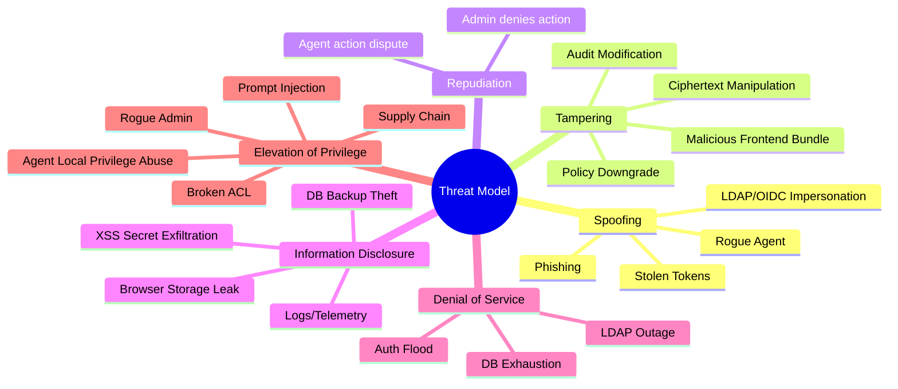

Angreifermodelle und Gegenmaßnahmen:

- Datenbank kompromittiert: Ciphertexts, Argon2id, Pepper getrennt, keine Klartext-Secrets, Audit Anchors.
- API-Server kompromittiert: keine Keys im Klartext, mTLS, least privilege DB user, signed frontend bundles, detection.
- Admin kompromittiert: SoD, MFA/WebAuthn, Just-in-time Admin, Audit, keine Secret-Backdoor.
- LDAP kompromittiert: MFA, Master-Passphrase separat, Gruppenänderungen auditieren, Risk Policies.
- Client kompromittiert: Auto-Lock, Device Trust, kein dauerhafter Klartext, WebAuthn, Agent Hardening, Security Training.
- Agent kompromittiert: Zertifikat widerrufen, application-bound policies, no plaintext cache, health, tamper detection.
- Backup gestohlen: Backup-Verschlüsselung, keine Pepper, clientseitige Payloads.
- Insider/Rogue Admin: keine serverseitige Entschlüsselung, Hash-chained Audit, dual control für Recovery.
- Replay: Nonces, TLS, token rotation, request timestamps, DPoP/mTLS optional.
- Session Hijacking: secure cookies, SameSite, refresh rotation, device binding, short access tokens.
- XSS/CSRF: CSP, Trusted Types, CSRF tokens, SameSite, output encoding, no inline scripts.
- Supply Chain: lockfiles, SBOM, signed images, dependency scanning, SLSA/attestations.
- Prompt Injection: keine LLMs mit direktem Toolzugriff auf Secrets, RAG-Ausgaben sandboxen, human approval für Aktionen, prompt/content separation, output validation.

## 23. Security Controls

Application Security:

- OWASP ASVS 5.0.0 Level 2/3 Ziel.
- Threat Modeling je Feature.
- Secure Coding Guidelines für .NET, TypeScript, Browser Extension, Windows Agent.
- SAST, DAST, SCA, Secrets Scanning, IaC Scanning.
- Security Unit Tests für ACL, tenant isolation, crypto version checks.
- Penetrationstest vor GA.
- Externe Kryptografieprüfung vor Enterprise Release.

Web Security:

- CSP strict-dynamic oder nonce-basiert, keine Inline-Skripte.
- Trusted Types.
- CSRF-Schutz.
- Secure, HttpOnly, SameSite Cookies wo Cookies genutzt werden.
- Token bevorzugt memory-only im SPA; Refresh Token Rotation mit Sender-Constraining prüfen.
- Keine Vault Keys in Local Storage.
- Clickjacking-Schutz, HSTS, X-Content-Type-Options, Referrer-Policy.

Auth Security:

- Argon2id für lokale Passwörter.
- Account Lockout und Rate Limiting.
- Breached Password Check via k-anonymity/HIBP-ähnlich optional.
- MFA für Admins verpflichtend.
- WebAuthn für Recovery Officer und Break-Glass.

Container Security:

- Non-root, read-only, minimal images.
- Docker socket nie mounten.
- Network Segmentation.
- SBOM und Signaturen.
- Runtime Policies.

AI/Prompt-Injection Controls:

- Keine KI im Secret-Entschlüsselungspfad.
- KI-Assistenten dürfen nur Metadaten nach strikter Policy sehen.
- Kein automatisches Ausführen von KI-generierten Admin-Aktionen.
- Tool-Ausführung nur mit expliziter Benutzerfreigabe, Scopes, Audit und Simulation.
- Untrusted Content Labels in UI und Backend.

## 24. UX-/Frontend-Konzept

Frontend:

- React + TypeScript.
- WebCrypto API für AES-GCM, HKDF, ECDH soweit möglich.
- Argon2id via geprüfter WASM-Bibliothek, Performance-Tuning pro Gerät.
- libsodium/WASM optional für XChaCha20-Poly1305 und Ed25519/X25519.
- Accessibility WCAG 2.2 AA Ziel.
- Deutsch/Englisch ab MVP.
- Dark Mode, mandantenfähiges Branding später.

Hauptbereiche:

- Dashboard: Risiken, ablaufende Secrets, offene Approvals, Agent Health.
- Tresore: persönlich, gemeinsam, Kunden/Mandanten, Projekte, Assets.
- Secret Detail: Felder, Maskierung, Kopieren, Use-only, History, Zugriff.
- Sharing: Rollen, Gruppen, Ablauf, JIT, Approval.
- Admin: Tenant, Benutzer, Gruppen, LDAP, MFA, Policies, Recovery, Agenten.
- Audit: Filter, Reports, Exporte.
- Developer: API Tokens, CLI, SDK Docs.

UX-Sicherheitsmuster:

- Risky Action Dialoge mit konkreten Konsequenzen.
- Step-up nur dort, wo sinnvoll, nicht bei jedem Klick.
- Klartext-Anzeige mit Timer, Wasserzeichen optional.
- Copy mit sichtbarem Countdown.
- Export prominent eingeschränkt.
- Orphaned Vaults und Recovery transparent, nicht versteckt.

## 25. Admin-Konzept

Admin-Ebenen:

- Platform Admins betreiben Plattform, sehen keine Secret-Inhalte.
- Tenant Admins verwalten Mandantenobjekte, sehen keine Secret-Inhalte ohne explizite eigene Freigabe.
- Security Admins steuern Policies und Recovery.
- Auditors lesen Audit und Reports.
- Support Admins benötigen Mandantenfreigabe, zeitlich begrenzt.

Admin-Aktionen:

- Alle privilegierten Aktionen auditieren.
- Kritische Änderungen erfordern MFA Step-up.
- Recovery, Export Policy Downgrade, Break-glass und Admin-Rollenänderungen erfordern Vier-Augen-Prinzip.
- Policy-Simulation vor Rollout.
- Admin-Doku und Betriebshandbuch müssen Teil des Release-Prozesses sein.

## 26. MVP-Definition

MVP Muss:

- Docker Compose Deployment.
- ASP.NET Core modularer Monolith.
- React/TypeScript Web UI.
- PostgreSQL.
- Mandantenfähigkeit im Datenmodell und UI.
- Lokale Konten mit Argon2id.
- LDAP/AD Auth und Sync Basis.
- OIDC/SAML vorbereitet oder rudimentär.
- TOTP, WebAuthn für Admins wenn realistisch.
- Master-Passphrase und clientseitige Kryptografie.
- Persönlicher und Shared Vault.
- Gruppenfreigabe kryptografisch über Wrapped Keys.
- Rollenmodell Basis.
- Secret CRUD und Secret-Typen Basis.
- Verschlüsselte Dateiablage Basis mit Attachments, Versionierung und Größenlimits.
- Template-/Maskenmodell Basis für strukturierte Secret-Typen wie Kreditkarten, Zertifikate, SSH Keys, Datenbanken und Lizenzen.
- Passwortgenerator.
- Browser Extension Basis.
- Windows-Agent Basis mit Named Pipe/CLI/PowerShell.
- Audit Basis mit Hash-Chaining vorbereitet.
- Backup/Restore.
- Monitoring/Logging Basis.
- Lizenzierungsfähigkeit technisch vorbereitet.
- Recovery-Konzept implementierungsnah vorbereitet, Shared Vault Ownership Transfer umgesetzt.
- Orphaned Vault Handling für deaktivierte Benutzer.

MVP Nicht:

- Vollständiges PAM.
- Session Recording.
- Mobile Apps.
- Vollständige Rotation.
- Kubernetes/Helm produktionsreif.
- MSP Billing.

## 27. Roadmap Phase 1 bis Phase 5

Phase 1: MVP

- Mandanten, lokale/LDAP-Identitäten, MFA, Zero-Knowledge-Vault, Shared Vaults, Audit Basis, Docker Compose, Browser Extension Basis, Agent Basis.

Phase 2: Enterprise Sharing, LDAP Sync, Policies

- OIDC/SAML produktionsreif, SCIM, erweiterter LDAP Sync, Policy Engine, Field-level Permissions, Recovery M-of-N, Export Controls, erweiterte Reports.

Phase 3: Agent, CLI, SDKs, SIEM

- Agent Hardening, RDP Launcher MVP+, PowerShell/.NET/Java/Python SDK, Splunk/Sentinel/Elastic, mTLS, Agent Health, Browser Extension Enterprise Policies.

Phase 4: Rotation, Approval, JIT

- AD/DB/Linux/API Rotation, Approval Workflows, Ticket-Integration, JIT Access, Rotation nach Zugriff/Incident/Austritt.

Phase 5: PAM Session Brokering

- RDP Broker, SSH Proxy, Web Proxy, Session Recording, Command Control, Credential-less Access, PAM Discovery, MSP Billing, Mobile Apps, Kubernetes/Helm GA.

## 28. Technologieempfehlung

Frontend:

- React + TypeScript.
- WebCrypto API für native Browser-Krypto.
- WASM für Argon2id und ggf. libsodium.
- Komponentenbibliothek mit eigenem Designsystem, keine unnötige Abhängigkeit von schwergewichtigen Admin-Templates.

Backend:

- ASP.NET Core auf .NET 8 LTS oder .NET 9, je nach Release-Zeitpunkt und Supportpolitik.
- Modularer Monolith für MVP.
- Modulgrenzen: Identity, Tenant, Vault, Crypto Metadata, Sharing, Policy, Audit, Agent, Reporting, Admin, Licensing.
- Spätere Extraktion einzelner Module als Services möglich.

Agent:

- .NET Windows Service.
- Tray App optional mit WinUI.
- PowerShell-Modul.
- Named Pipe und localhost mTLS.
- DPAPI/TPM/Windows Credential Manager.
- Code Signing zwingend.

Daten:

- PostgreSQL.
- Redis optional.
- MinIO/S3 optional für Attachments.

Deployment:

- Docker Compose MVP.
- Kubernetes/Helm Roadmap.
- Traefik oder NGINX. Empfehlung MVP: Traefik für einfache TLS/Lab-Setups, NGINX/Envoy für Enterprise evaluieren.

Token:

- JWT ist verbreitet, aber widerrufstechnisch anspruchsvoll.
- PASETO kann sicherere Defaults bieten, ist aber weniger verbreitet im Enterprise-Ökosystem.
- Empfehlung MVP: kurze JWT Access Tokens plus refresh token rotation und serverseitige session records; PASETO als ADR prüfen.

## 29. Risiken und Designentscheidungen

Wichtige ADRs:

- ADR-001: Modularer Monolith statt Microservices im MVP.
- ADR-002: AES-256-GCM als MVP-Default wegen WebCrypto; XChaCha20-Poly1305 als geprüfte Alternative.
- ADR-003: Master-Passphrase getrennt von LDAP/OIDC/SAML.
- ADR-004: Mandantenfähigkeit ab Tag 1.
- ADR-005: Keine Admin-Backdoor.
- ADR-006: Recovery nur via M-of-N Recovery Officers.
- ADR-007: Agent Use-only ist Sicherheitsverbesserung, aber kein absoluter Schutz gegen kompromittierte Endpunkte.
- ADR-008: Browser-Webclient braucht Supply-Chain- und Bundle-Integritätskontrollen.

Risiken:

- Kompromittierter Client kann Secrets exfiltrieren, sobald sie lokal entschlüsselt werden.
- Web-Zero-Knowledge ist abhängig von vertrauenswürdig ausgeliefertem JavaScript.
- Gruppenentzug kann bereits lokal gespeicherte/erinnerte Secrets nicht rückwirkend löschen.
- Credential Injection ist je Zielsystem technisch unterschiedlich zuverlässig.
- Recovery kann missbraucht werden, wenn M-of-N und Audit schwach umgesetzt werden.
- Volltextsuche kann Metadaten leaken.
- Zu frühe Microservices erhöhen Komplexität und Angriffsfläche.

Regelmäßiger Review:

- Pro Phase Architektur-Review.
- Pro sicherheitskritischem Epic Threat Model.
- Nach jedem größeren Modul "Better Way Review": Build vs Buy, Library-Auswahl, Kryptografie, UX-Reibung, Betriebskosten.
- Quartalsweise Roadmap-Review gegen neue Threats, OWASP/NIST-Updates und Kundenerfahrungen.

## 30. Teststrategie

Testpyramide:

- Unit Tests: Policy Engine, ACL, Crypto Metadata, KDF Parameter, tenant isolation.
- Property Tests: Krypto-Envelope, Nonce uniqueness, serialization canonicalization.
- Integration Tests: LDAP, DB, Audit chain, API auth, agent registration.
- E2E Tests: Login, MFA, Unlock, Secret CRUD, Sharing, Agent Request, Extension Autofill.
- Security Tests: SAST, DAST, SCA, container scanning, secrets scanning.
- Fuzzing: API parsers, importers, extension message handling.
- Chaos/DR: DB restore, LDAP outage, Redis outage, expired certs.
- Performance: unlock metadata, vault listing, audit queries, LDAP sync, agent concurrency.

Quality Gates:

- Kein Release mit kritischen SCA/SAST Findings.
- Kryptografie-Testvektoren versioniert.
- Restore-Test vor Enterprise GA.
- Penetrationstest vor kommerziellem Launch.
- Agent-Code-Signing und Update-Verifikation getestet.

## 31. DevSecOps-/CI-CD-Konzept

Repositories:

- mono-repo initial empfohlen: backend, frontend, extension, agent, infra, docs.
- Alternativ später getrennte Repos für Agent/Extension.

Branching:

- main protected.
- short-lived feature branches.
- PR Review Pflicht.
- Security Review für crypto/auth/agent/admin.

Pipeline:

- Format/Lint.
- Unit/Integration.
- SAST/SCA/Secrets Scan.
- Container Build.
- SBOM.
- Image Scan.
- Image Signing.
- Compose smoke test.
- Docs build.
- Release notes.

Git/Docker-Hub Sync:

- Permanente Synchronisierung sinnvoll über CI/CD, nicht manuell.
- Push nach Git remote bei stabilen Arbeitspaketen.
- Docker Hub oder private Registry nur mit signierten Images, semver tags und immutable digests.
- Secrets für Registry niemals im Repo, nur CI Secret Store.
- Arbeitspakete klein halten: 0,5 bis 2 Tage Umfang, klare Definition of Done, Review direkt danach.

Dokumentation als Produktbestandteil:

- Systemdoku: Architektur, Datenmodell, Kryptomodell, Deployment.
- Admindoku: Tenant, LDAP, MFA, Policies, Recovery, Backup, Restore.
- Benutzerdoku: Vault, Sharing, Extension, Agent, Recovery Codes.
- Entwicklerdoku: API, SDK, CLI, Contribution, Secure Coding.
- Betriebshandbuch: Installation, Update, Monitoring, Incident, DR.
- Sicherheitsdoku: Threat Model, Controls, Pen-Test Scope, Hardening.

## 32. Beispiel-Docker-Compose für MVP

```yaml
services:
  reverse-proxy:
    image: traefik:v3
    command:
      - --providers.docker=true
      - --entrypoints.websecure.address=:443
    ports:
      - "443:443"
    networks: [public, app]
    read_only: true

  web:
    image: ghcr.io/example/zkpam-web:0.1.0
    networks: [app]
    read_only: true
    security_opt: ["no-new-privileges:true"]

  api:
    image: ghcr.io/example/zkpam-api:0.1.0
    networks: [app, data]
    depends_on: [postgres]
    secrets:
      - db_password
      - pepper_secret
    environment:
      ASPNETCORE_ENVIRONMENT: Production
    read_only: true
    tmpfs: ["/tmp"]
    security_opt: ["no-new-privileges:true"]

  worker:
    image: ghcr.io/example/zkpam-worker:0.1.0
    networks: [app, data]
    depends_on: [postgres]
    secrets:
      - db_password
    read_only: true
    tmpfs: ["/tmp"]

  postgres:
    image: postgres:16
    networks: [data]
    volumes:
      - pgdata:/var/lib/postgresql/data
    secrets:
      - db_password

secrets:
  db_password:
    file: ./secrets/db_password.txt
  pepper_secret:
    file: ./secrets/pepper_secret.txt

networks:
  public:
  app:
    internal: true
  data:
    internal: true

volumes:
  pgdata:
```

Hinweis: Das Beispiel ist bewusst minimal. Produktionsreif fehlen TLS-Zertifikate, Backup, Monitoring, Image Digests, Resource Limits und vollständiges Hardening.

## 33. Beispiel-Helm-/Kubernetes-Zielbild

```yaml
apiVersion: apps/v1
kind: Deployment
metadata:
  name: zkpam-api
spec:
  replicas: 3
  selector:
    matchLabels:
      app: zkpam-api
  template:
    metadata:
      labels:
        app: zkpam-api
    spec:
      securityContext:
        runAsNonRoot: true
      containers:
        - name: api
          image: ghcr.io/example/zkpam-api@sha256:REPLACE
          ports:
            - containerPort: 8080
          readinessProbe:
            httpGet:
              path: /health/ready
              port: 8080
          livenessProbe:
            httpGet:
              path: /health/live
              port: 8080
          securityContext:
            readOnlyRootFilesystem: true
            allowPrivilegeEscalation: false
            capabilities:
              drop: ["ALL"]
          resources:
            requests:
              cpu: "250m"
              memory: "512Mi"
            limits:
              cpu: "1"
              memory: "1Gi"
```

Zielbild:

- Helm values pro Mandant/Umgebung.
- NetworkPolicy default deny.
- External PostgreSQL HA.
- cert-manager für TLS.
- External Secrets für Betriebssecrets.
- Prometheus ServiceMonitor.
- Loki/OpenSearch Logging.
- Argo CD/Flux GitOps optional.

## 34. Beispiel-API-Endpunkte

Secret abrufen:

```http
GET /api/v1/secrets/01HX.../versions/latest
Authorization: Bearer <access-token>
X-Tenant-Id: contoso
```

Antwort enthält nur Ciphertext:

```json
{
  "secretId": "01HX...",
  "version": 4,
  "cryptoVersion": "v1",
  "payloadCiphertext": "base64...",
  "wrappedDek": "base64...",
  "aad": {
    "tenantId": "contoso",
    "vaultId": "01HV...",
    "secretId": "01HX...",
    "version": 4
  }
}
```

Agent registrieren:

```http
POST /api/v1/agents/register
{
  "tenantId": "contoso",
  "deviceName": "WKS-1024",
  "publicKey": "base64...",
  "csr": "base64..."
}
```

Audit exportieren:

```http
GET /api/v1/audit/events?from=2026-05-01T00:00:00Z&format=jsonl
```

Dateiupload initiieren:

```http
POST /api/v1/files/initiate-upload
{
  "tenantId": "contoso",
  "vaultId": "01HV...",
  "secretId": "01HX...",
  "encryptedManifest": "base64...",
  "chunkCount": 24,
  "totalSize": 125829120
}
```

Template-Beispiel abrufen:

```http
GET /api/v1/secret-templates?type=certificate
```

## 35. Beispiel-Datenmodell

ER-Überblick:

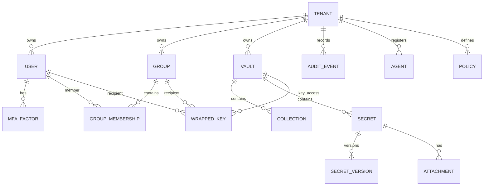

## 36. Beispiel-Abläufe als Sequenzdiagramme

Recovery Flow:

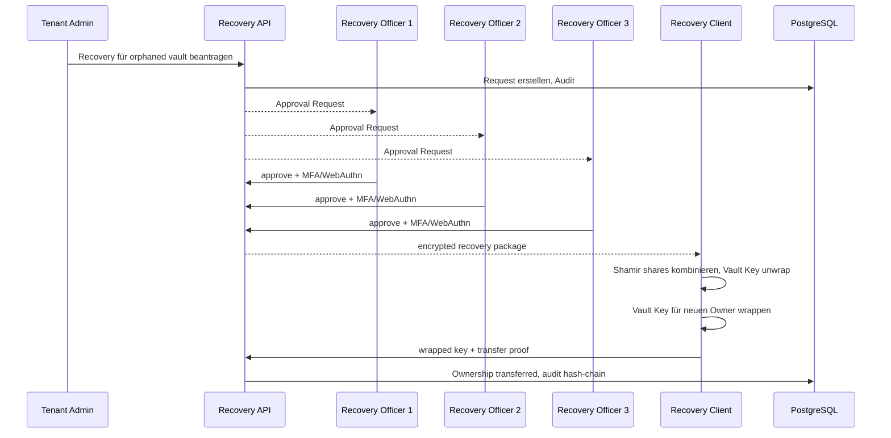

Deployment Topologie:

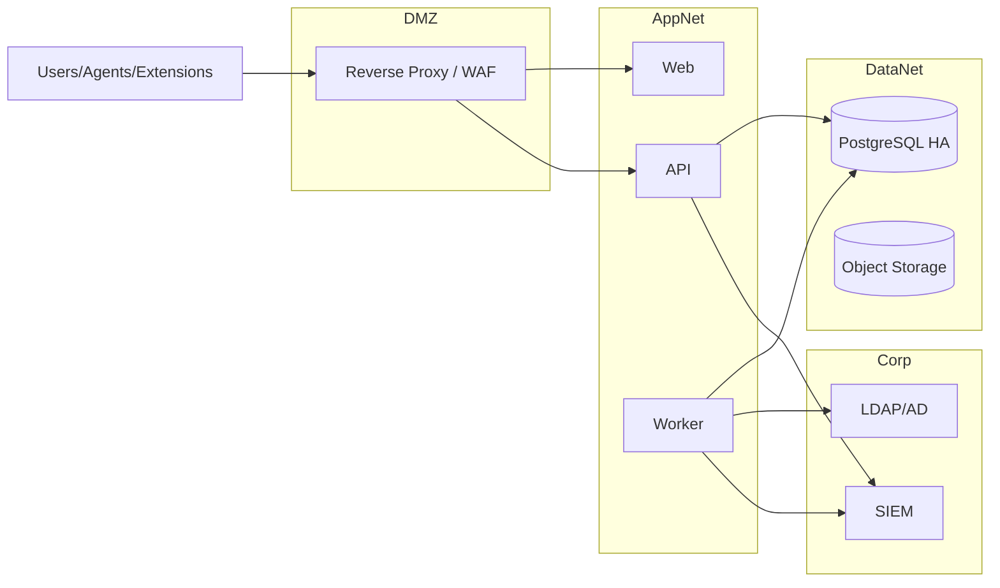

## 37. Offene Fragen an den Auftraggeber

Zielgruppe:

- Welche Branchen zuerst: MSP, Mittelstand, Konzern-IT, KRITIS, Behörden?
- Sind externe Kundenmandanten im MVP zwingend oder nur technisch vorbereitet?

Betriebsmodell:

- On-Premises only, Private Cloud, SaaS oder Hybrid?
- Welche Registry: Docker Hub, GHCR, private Registry?
- Welche Git-Plattform und Organisation sollen genutzt werden?

Authentifizierung:

- Welche IdPs sind zuerst relevant: AD FS, Entra ID, Keycloak, Okta?
- WebAuthn im MVP zwingend oder Admin-only ausreichend?

LDAP/AD:

- Nested Groups und Multi-Forest im MVP erforderlich?
- Soll Kerberos/Windows Integrated Auth geplant werden?

Verschlüsselung:

- AES-GCM als MVP-Default akzeptiert oder XChaCha20-Poly1305 bevorzugt trotz WASM-Abhängigkeit?
- Soll ein externer KMS/HSM für Betriebssecrets und Pepper unterstützt werden?

Agent:

- Ist RDP Launcher im MVP Pflicht oder MVP+?
- Welche Zielanwendungen für Application-bound Übergabe zuerst?

Browser Extension:

- Soll die Extension direkt mit Backend sprechen oder bevorzugt über lokalen Agent?
- Muss Firefox im MVP enthalten sein oder Chrome/Edge zuerst?

PAM:

- Welche PAM-Funktion ist kommerziell zuerst am wertvollsten: RDP Broker, SSH Proxy, Rotation, JIT oder Discovery?

Compliance:

- Welche Normen sind verkaufsentscheidend: ISO 27001, SOC 2, BSI, KRITIS, TISAX?
- Welche Audit-Retention ist nötig?

Skalierung:

- 5.000 Benutzer pro Mandant oder plattformweit?
- Erwartete Secret-Anzahl und Agent-Anzahl?

MVP-Priorisierung:

- Was ist wichtiger: Browser Extension, Windows Agent oder Rotation?
- Wie viel UX-Polish muss MVP haben?

Budget/Timeline:

- Zieltermin für klickbaren Prototyp, MVP, Pilot, GA?
- Teamgröße und verfügbare Rollen: Backend, Frontend, Agent, Security, DevOps, UX?

## 38. Entscheidungsvorlage: MVP vs Enterprise-Zielarchitektur

Empfehlung:

- MVP als modularer Monolith mit harten Modulgrenzen.
- Mandantenfähigkeit, Zero Knowledge, Audit und Recovery-Design nicht verschieben.
- Microservices erst extrahieren, wenn Skalierung, Teamgrenzen oder Compliance es erzwingen.

MVP gewinnt durch:

- Schnellere Entwicklung.
- Weniger Betriebsaufwand.
- Einfacheres Debugging.
- Kleinere Angriffsfläche.
- Konsistentere Transaktionen für ACL/Audit/Key Metadata.

Enterprise-Zielarchitektur gewinnt später durch:

- Unabhängige Skalierung von Agent Gateway, Audit, Reporting, Rotation und Notification.
- Separierbare Sicherheitszonen.
- Mandanten-/MSP-spezifische Skalierung.
- Bessere Resilienz bei hoher Last.

Extraktionskandidaten:

- Audit Service.
- Agent Gateway.
- LDAP Sync Worker.
- Reporting Service.
- Rotation Service.
- SIEM Exporter.
- PAM Session Broker.

Finale Architekturentscheidung:

- Start: ASP.NET Core modularer Monolith + Worker.
- Ab Phase 3: Agent Gateway und Audit Export als eigene Services prüfen.
- Ab Phase 4: Rotation Service isolieren.
- Ab Phase 5: PAM Session Broker als eigenständige Hochsicherheitskomponente.

## 39. Kleine Arbeitspakete für die Umsetzung

Empfohlene Paketgröße: 0,5 bis 2 Tage, jeweils mit Review.

Startpakete:

- AP-001: Repo-Struktur, README, Architekturindex, ADR-Ordner.
- AP-002: Docker Compose Skeleton mit API, Web, PostgreSQL.
- AP-003: Tenant-Datenmodell und Migrationen.
- AP-004: Lokale Benutzer mit Argon2id.
- AP-005: MFA TOTP Enrollment und Verify.
- AP-006: WebAuthn Spike.
- AP-007: Crypto Spike WebCrypto AES-GCM + Argon2id WASM.
- AP-008: Vault Key und Wrapped Key Datenmodell.
- AP-009: Secret CRUD mit Ciphertext-only API.
- AP-009a: Verschlüsselte Dateiablage mit chunked upload/download.
- AP-009b: Secret Templates und dynamische Eingabemasken.
- AP-010: React Unlock Flow.
- AP-011: LDAP Auth Spike.
- AP-012: LDAP Sync MVP.
- AP-013: Shared Vault und Gruppenfreigabe.
- AP-014: Audit Event Store mit Hash-Chaining.
- AP-015: Admin UI Tenant/User/Group Basis.
- AP-016: Browser Extension Skeleton.
- AP-017: Extension Autofill PoC mit Domain Binding.
- AP-018: Windows Agent Service Skeleton.
- AP-019: Named Pipe Local API.
- AP-020: PowerShell Modul PoC.
- AP-021: Backup/Restore Skript und Restore-Test.
- AP-022: CI Pipeline mit Tests, SCA, SBOM, Image Scan.
- AP-023: Docker Image Signing und Registry Push.
- AP-024: System-, Admin- und Benutzerdoku Skeleton.

Definition of Done je Arbeitspaket:

- Code implementiert.
- Tests grün.
- Security-Impact geprüft.
- Doku aktualisiert.
- ADR ergänzt, falls Designentscheidung.
- Review abgeschlossen.
- Image/Artefakt nur bei stabilem Stand gepusht.

## 40. Browser-Extension-Konzept

Zielbrowser:

- MVP: Chrome und Edge, weil beide Chromium-basiert sind und Enterprise-Deployment gut unterstützen.
- Phase 2: Firefox.
- Später: Safari, abhängig von Kundenbedarf und Apple-Ökosystem.

Funktionen:

- Login-Formular-Erkennung über Content Script mit minimalen Rechten.
- Icon im Eingabefeld, wenn passende Credentials vorhanden sind.
- Browser-Toolbar-Status bei bekannten Domains.
- Auswahl mehrerer Credentials pro Domain.
- Autofill nur nach Benutzerinteraktion.
- Speichern neuer Logins nach erfolgreichem Login.
- Aktualisieren bestehender Credentials nach Passwortänderung.
- Passwortgenerator nach Mandanten-/Vault-/Gruppenpolicy.
- Zielauswahl: persönlicher Vault, Shared Vault, Collection, Ordner, Tags, Owner.
- Step-up für kritische Web-Credentials.
- Use-only optional über lokalen Agent statt direkter Extension-Übergabe.

Phishing- und Web-Schutz:

- Exakte Origin-Prüfung, nicht nur Stringvergleich.
- Domain Matching mit eTLD+1, Subdomain-Regeln und expliziten Wildcards.
- Warnung bei ähnlichen Domains und Homoglyphen.
- Kein Autofill in iframes unbekannter Herkunft.
- Keine automatische Secret-Injektion ohne User Gesture.
- Content Script bekommt Secrets nur unmittelbar vor Fill und nur für aktive Origin.
- Keine Klartext-Secrets in extension storage.
- Session Lock und Auto Lock.

Kommunikation:

- Direkt Backend API: Extension entschlüsselt lokal, Tokens kurzlebig.
- Über lokalen Agent: bevorzugt für Use-only, Device Trust und Application-bound Policies.
- Native Messaging Host optional für tiefe Windows-Integration.

Zero-Knowledge:

- Entschlüsselung lokal in Extension oder Agent.
- Backend liefert nur Ciphertext und Wrapped Keys.
- Keine Klartexte in Logs, DevTools-Messages, Telemetrie oder Storage.
- Extension-Builds signieren und reproduzierbar machen.

## 41. Mobile-Apps-Roadmap

Mobile Apps sind strategisch geplant, aber nicht MVP.

iOS/Android Funktionen:

- Vault-Zugriff mit lokaler Entschlüsselung.
- Autofill über OS-Mechanismen.
- Biometrisches Entsperren als lokaler Schutz eines bereits provisionierten Keys, nicht als Ersatz für Kryptografie.
- Gerätebindung und Device Revocation.
- Push-MFA optional.
- Secure Notes und Secret-Anzeige.
- Approval-Workflows für Approver.
- Notfallzugriff optional.
- Offline-Cache nur stark verschlüsselt und policygesteuert.
- MDM/Enterprise Deployment.
- Mandantenfähigkeit.

Sicherheitsentscheidungen:

- Secure Enclave/Keychain auf iOS, Android Keystore/StrongBox auf Android.
- Keine Klartext-Secrets in Backups.
- Screenshot-/Screen-Recording-Schutz, soweit OS-seitig möglich.
- Jailbreak/Root Detection als Signal, nicht als alleinige Sicherheitsbarriere.

## 42. Umgang mit gelöschten, deaktivierten und ausgeschiedenen Benutzern

Statusmodell:

- Active.
- Disabled.
- Locked.
- Pending Deletion.
- Soft Deleted.
- Purged.
- Orphaned Vault.
- Recovery Pending.
- Ownership Transfer Pending.
- Ownership Transferred.

Shared Vaults:

- Shared Vaults dürfen nie nur von einem einzelnen Benutzer kryptografisch abhängen.
- Vault Keys werden für definierte Owner, Gruppen und optional Recovery-Strukturen gewrappt.
- Bei Deaktivierung eines Benutzers bleiben Shared Vaults verfügbar, wenn weitere Owner/Gruppen/Recovery Keys existieren.
- Tenant Admin oder Vault Admin kann Ownership administrativ neu zuweisen.
- ACLs werden angepasst, Group Keys bei kritischen Vaults rotiert.
- Audit Event ist Pflicht.

Private Vaults:

- Private Vaults sind grundsätzlich nur durch den Benutzer entschlüsselbar.
- Admins dürfen sie nicht einfach lesen.
- Übernahme ist nur möglich, wenn Enterprise Recovery vorab aktiviert und der Vault Key zusätzlich für den Recovery Public Key gewrappt wurde.
- Ohne Recovery gibt es nur Löschung oder Aufbewahrung als nicht entschlüsselbarer geschützter Datenbestand.

Enterprise Recovery:

- Mandant aktiviert Recovery explizit.
- Beim Vault-Anlegen oder ersten Unlock wird Vault Key für Recovery Public Key verschlüsselt.
- Recovery Private Key liegt nicht bei einem Admin.
- M-of-N Shamir Secret Sharing, Beispiel 3 von 5 Recovery Officers.
- Recovery erfordert MFA/WebAuthn, Begründung, Ticketnummer optional, Wartefrist optional.
- Tenant Owner oder Security Admin kann zusätzliche Genehmigungspflicht definieren.
- Nach Recovery wird Vault Key für neuen Owner gewrappt.
- Alle Schritte werden manipulationssicher auditiert.

Automatische Prozesse:

- LDAP Sync erkennt disabled/deleted Benutzer.
- Sessions, Refresh Tokens und Agent Bindings werden widerrufen.
- System erstellt Review-Aufgaben für Vault Ownership.
- Tenant Admin sieht Liste betroffener Vaults.
- Private Vaults werden als orphaned but protected markiert.
- Ohne Enterprise Recovery kann kein Klartextzugriff hergestellt werden.

Compliance:

- Personenbezogene Kontodaten können nach Retention pseudonymisiert oder gelöscht werden.
- Geschäftliche Secrets bleiben nach geregeltem Ownership-/Recovery-Prozess verfügbar.
- Datenschutz, Security und Fachbereich können als Genehmigungsrollen modelliert werden.

## 43. Explizite Antworten auf Architekturfragen

1. LDAP-Login und Zero Knowledge:
LDAP authentifiziert Identität, entsperrt aber keinen Vault. Der Vault wird separat über Master-Passphrase oder vertrauenswürdiges Gerät entsperrt. Das LDAP-Passwort ist kein dauerhafter Vault-Schlüssel.

2. Einführung, Änderung und Recovery der Master-Passphrase:
Beim Onboarding erzeugt der Client User Keys und Vault Keys, verschlüsselt den User Private Key mit einem KEK aus der Master-Passphrase und speichert nur Ciphertext. Bei Änderung wird nur Key-Material neu gewrappt, nicht jedes Secret. Recovery geht nur über vorher aktivierte Recovery Keys und M-of-N Recovery Officers.

3. Kryptografisch saubere Gruppenfreigabe:
Gruppen erhalten Group Keys. Vault Keys werden für Group Keys gewrappt. Mitglieder erhalten Zugriff auf den Group Key über ihren User Public Key. Beim Entfernen kritischer Mitglieder wird der Group Key rotiert.

4. Secrets teilen ohne serverseitige Entschlüsselung:
Der berechtigte Client entschlüsselt lokal den Vault Key und wrappt ihn für Empfänger oder Gruppe. Der Server validiert ACL, Signatur und Policy, sieht aber keinen Klartext.

5. Windows-Agent ohne neues Hauptrisiko:
Agenten werden gerätegebunden, zertifikatsbasiert registriert, signiert, widerrufbar, auditierbar und speichern lokal keine Klartext-Secrets. Übergaben sind kurzlebig, policygesteuert und application-bound.

6. Secret-Übergabe an Anwendungen:
Bevorzugt über Named Pipe/localhost mTLS/SDK mit Prozessprüfung. UI Injection nur, wenn nötig. Übergaben sind kurzlebig, speicherarm, ohne Logs und abhängig von Prozesspfad, Signatur, Hash, Benutzer, Gerät und Policy.

7. Grenzen von Credential Injection:
RDP ist abhängig von Windows/NLA/Credential Guard. Web ist über Extension sauberer als generisches Hooking. Java/.NET sollten SDK/Agent API nutzen. Desktop-UI-Automation ist fragil und spoofing-anfällig. Dienste/Tasks sollten nicht dauerhaft Klartext in Config schreiben.

8. Zwingend clientseitig zu entschlüsseln:
Secret Payloads, Secret DEKs, Vault Keys, Group Keys, User Private Keys, TOTP Seeds und Attachments. Server darf nur Metadaten, Public Keys, Ciphertexts und Wrapped Keys verarbeiten.

9. Serverseitig indexierbare Daten:
Nicht-sensitive Metadaten wie Typ, Status, Owner, Kritikalität, Ablaufdatum, Tags nach Policy, Asset-IDs und Domain-Hashes. Keine Secret-Werte, privaten Notizen, Passwörter, Keys oder sensiblen Feldnamen im Klartext.

10. Audit ohne Secret-Inhalte:
Audit speichert Aktion, Actor, Resource IDs, Zeit, Client, IP, Device, Policy Result und Hash Chain. Secret-Inhalte, Passphrases und Tokens sind verboten.

11. Backup-Schutz:
Backups enthalten nur Ciphertexts und gehashte Login-Credentials. Backup wird zusätzlich verschlüsselt. Pepper und Betriebssecrets liegen getrennt. Restore wird regelmäßig getestet.

12. Recovery ohne Zero-Knowledge zu zerstören:
Recovery Public Key wird vorab als zusätzlicher Empfänger gewrappt. Der Private Key ist M-of-N geschützt. Kein einzelner Admin kann entschlüsseln. Recovery ist genehmigungspflichtig und auditiert.

13. LDAP-Deaktivierung:
Login blockieren, Sessions/Tokens/Agenten widerrufen, Shared Vault Ownership prüfen, Private Vaults orphaned but protected markieren, Recovery-Aufgabe erzeugen.

14. LDAP-Gruppenänderungen:
Neue Mitglieder erhalten Zugriff erst nach Key-Wrapping. Entfernte Mitglieder verlieren zukünftigen Zugriff; bei kritischen Vaults Group Key Rotation und ggf. Secret Rotation.

15. Alte Secret-Zugriffe entziehen:
Zukünftige Abrufe blockieren, Keys rotieren, Sessions invalidieren, Agent Cache löschen, kritische Secrets rotieren. Bereits gesehene oder kopierte Secrets können nicht kryptografisch "vergessen" gemacht werden.

16. Agenten registrieren und widerrufen:
Registrierung über Enrollment Flow, CSR, Agent-Zertifikat, Device ID, User/Tenant Binding und Admin Policy. Widerruf über Status, CRL/denylist, Token revoke, Cache purge und Audit.

17. Heimlichen Admin-Zugriff verhindern:
Admins besitzen keine Vault Keys. Neue eigene Zugriffe erfordern vorhandenen Owner-Client oder M-of-N Recovery. Jede ACL-/Recovery-Aktion wird auditiert. Supportzugriff braucht Mandantenfreigabe.

18. MVP vs spätere Phasen:
MVP enthält Mandanten, Zero Knowledge, LDAP/lokal, MFA, Vaults, Sharing, Agent/Extension Basis, Audit, Docker Compose. Später folgen Rotation, JIT/Approval, SIEM, SDKs, Mobile, Kubernetes und vollständiges PAM.

## 44. Produktname und Branding

Technischer Projektname:

- `pwdmgr` bleibt der interne Projekt-, Repo- und Arbeitspaketname.
- Vorteil: kurz, eindeutig, technisch, gut für Services, Container, CLI und Git.
- Nachteil: als kommerzieller Produktname zu generisch und zu sehr auf Passwörter begrenzt, obwohl das Produkt Secrets, Credentials, Agenten und PAM abdeckt.

Namenskriterien:

- Muss nach Sicherheit, Kontrolle und Vertrauen klingen.
- Soll nicht nur "Password" sagen, sondern Vault, Secrets, Access und PAM mitdenken.
- Soll im Deutschen und Englischen funktionieren.
- Soll als CLI, Agent, Browser-Extension und Enterprise-Portal gut klingen.
- Soll nicht zu generisch sein und später markenrechtlich prüfbar bleiben.
- Soll seriös genug für Enterprise sein, aber nicht langweilig.

Namenskandidaten:

- **Vaulticore**: starker Enterprise-Klang, verbindet Vault und Core. Gute Plattform-Assoziation.
- **Keyhaven**: zugänglich, sicherer Hafen für Schlüssel und Secrets.
- **CipherNest**: moderner Security-Name, etwas weicher, gut für Zero-Knowledge.
- **Privora**: klingt nach Privilege, Privacy und Aura, gut für PAM-Roadmap.
- **Lockspire**: einprägsam, Enterprise-tauglich, "Spire" als Turm/Leitstruktur.
- **Secretis**: direkt und professionell, aber eventuell zu nah an generischem Secret-Begriff.
- **Vaultlane**: gut für Zugriffspfade, Agenten, PAM und Workflows.
- **Credora**: Credential-orientiert, freundlich, kommerziell gut nutzbar.
- **IronVale**: sicher, ruhig, etwas markanter, weniger technisch.
- **AegisVault**: klassischer Schutzbegriff, stark, aber möglicherweise markenrechtlich schwieriger.
- **NullGate**: technisch-cool, Zero-Knowledge-Assoziation, aber etwas härter und erklärungsbedürftig.
- **TrustForge**: stark für Enterprise, aber weniger spezifisch für Secrets.

Empfehlung:

- Favorit 1: **Privora**. Deckt Privacy, Privileged Access und Enterprise-Security gut ab, ohne auf Passwörter beschränkt zu sein.
- Favorit 2: **Vaulticore**. Sehr passend als Plattformname, technisch stark und skalierbar.
- Favorit 3: **Keyhaven**. Sehr nutzerfreundlich, gut für ein Produkt, das auch nicht-technische Anwender abholen soll.

Mögliche Produktarchitektur im Naming:

- `pwdmgr` als Repository/Interner Codename.
- `Privora` als Produktname.
- `Privora Vault` für Password/Secret Manager.
- `Privora Agent` für Windows-Agent.
- `Privora Connect` für Browser Extension und Integrationen.
- `Privora PAM` für spätere Session-Brokering-Module.
- `Privora MSP` für Mandanten-/Dienstleisteredition.

Nächster Schritt:

- Vor finaler Festlegung Domain-, Marken- und Paketnamen prüfen.
- Danach Naming in README, Docker Images, Namespace, CLI und UI konsistent festlegen.
